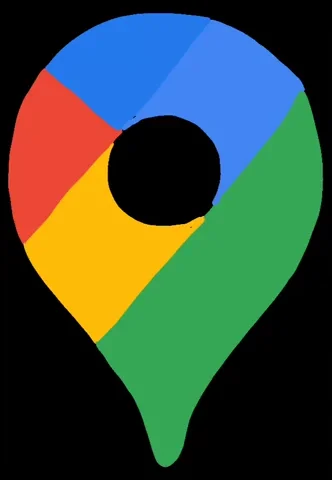

<!--horizontal divider(gradiant)-->

<h1 align='center'> </img> Hi, I am Factor Developer ! </h1>

<picture></picture> About me

<picture></picture>

<!--Intro start-->
- 🌐 I’m **Full Stack Web / Mobile Developer**📲

- ☁️ I’m **Cloud Engineer** in **Google Cloud, AWS, Catalyst bu Zoho**

- 💬 Ask me about **Programming, Web, Android Architecture, Cloud, IoT, Edge Computing**

- 🌱 I’m currently learning **Data Science** and **Artificial Intelligence**

- 📫 Feel free to reach me out **<a href="mailto:felipeherrerapinzon@gmail.com" target="blank">felipeherrerapinzon@gmail.com</a>**

- 💼 I’m currently Working on Mobile Apps Develop

- 🤝 I’m available for freelancing.

- 📄 Know about my experience **<a href="https://factordeveloper.github.io/Portafolio-Proyectos/" target="blank">Portfolio</a>**
<!--Intro end-->

 
 

<!--horizontal divider(gradiant)-->

 

<h1 align='center'> </img> My Technologies </img> </h1>

<picture></picture>

<!--tech stack icons-->
<h1 align='center'>
  
</h1>

 
 

 

<h1  align="center"> My Portfolio</h1>

<picture><picture>

 
 
<a href="https://factordeveloper.github.io/Portafolio-Proyectos/" target="blank">
 Portfolio</a>
 
 
 
<a href="https://play.google.com/store/apps/dev?id=6616258522728580660" target="blank">
 Play Store</a>
 
 
 
<a href="https://developers.google.com/profile/u/factor-developer" target="blank">
 Google Developer Program</a>
 
 

 

<h1 align='center'>  Connect With Me  </h1>

<!--social icons-->

  
  
   
     
  
   
  

<!--social icons-->

 

	

 

	

<!-- 
## 📺 Latest YouTube Videos

<table>
  <tbody>
<tr><td></td>
<td><a href="https://www.youtube.com/watch?v=">Getting the user's location with JavaScript (Geolocation API tutorial)</a> Dec 22, 2020</td></tr>
<tr><td></td>
<td><a href="https://www.youtube.com/watch?v=">Build a Weather App with HTML, CSS & JavaScript</a> Dec 10, 2020</td></tr>
<tr><td></td>
<td><a href="https://www.youtube.com/watch?v=-g">Making a Responsive (Birthday) Card with HTML and CSS</a> Dec 1, 2020</td></tr>
<tr><td></td>
<td><a href="https://www.youtube.com/watch?v=">How to Create Custom Snippets for Any Language in VS Code</a> Nov 17, 2020</td></tr>
<tr><td></td>
<td><a href="https://www.youtube.com/watch?v=">How to Type HTML and CSS Faster with Emmet</a> Nov 10, 2020</td></tr>

</tbody>
  </table>

-->

	

